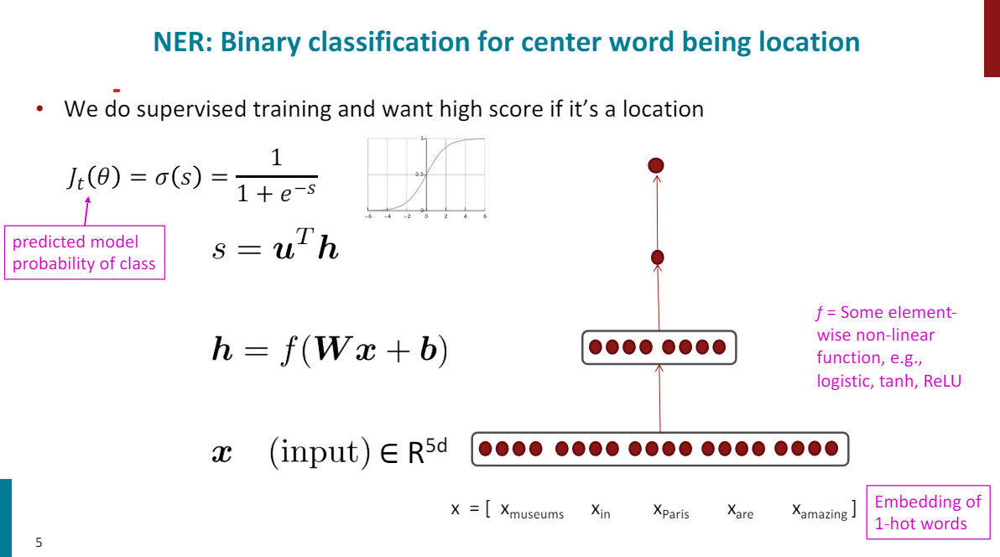

# Study Plan:
- [ ] [Watch the Stanford CS224n Lecture 3](https://youtu.be/X0Jw4kgaFlg?si=Vow0dimWJ8nJP-KP)
- [x] Implement a neural network from scratch
    - [x] Dot Product
    - [x] Vector-Matrix Multiplication
    - [x] Forward Pass
    - [x] Implementing Gradient Descent & SGD
    - [x] Loss Function
    - [x] Backpropagation
    - [x] Activation function (ReLU)

- [ ] Backpropagation from scratch
- [ ] Pytorch concepts understanding

## Resources:
- [ ] [Andrej Karpathy backpropagation video](https://youtu.be/VMj-3S1tku0?si=PnMsxlcrES5BCH1k)
- [ ] NN Chapter from deep learning book
- [ ] [3Blue1Borwn - Nural Network Playlist](https://www.youtube.com/playlist?list=PLZHQObOWTQDNU6R1_67000Dx_ZCJB-3pi)
- [ ] [CS224n Pytorch Tutorials](https://youtu.be/Uv0AIRr3ptg?si=HOMhb06fzqnlmHf9)

# Notes
# Lecture 3 - Backprop and Neural Networks
## Neural Networks
We will start with the simplest neural network, classify each word in ot's contect window of neighboring words. 
- for simplicity, we will train logistic classifier to classify center word {yes/no} for each class based on a concatenation of word vectors in a window. 

Example: classify if "Paris" is location or not in context of sentence with window length 2: 
- "The museums in Paris are amazing to see"
- $$ X_{window} = [x_{museums}, x_{in}, x_{are}, x_{amazing}] $$

**What We are going to do?**
- Use the word vectors and build up a context window of word vectors
- Put them into a neural network layer
- Then feed it through a logistic classifier that will predict is it a high probability location or not
### Bulding a NER (Named Entity Recognition) Classifier

- The neural network layer here is: $h= f(Wx+b)$
- $W$ is the weight **matrix**
- $x$ is the **input vector**
- $b$ is the bias vector
- $f$ is the **activation function** (e.g. ReLU, Sigmoid, Tanh) just to make the network non-linear
- $h$ is the **hidden layer** representation

