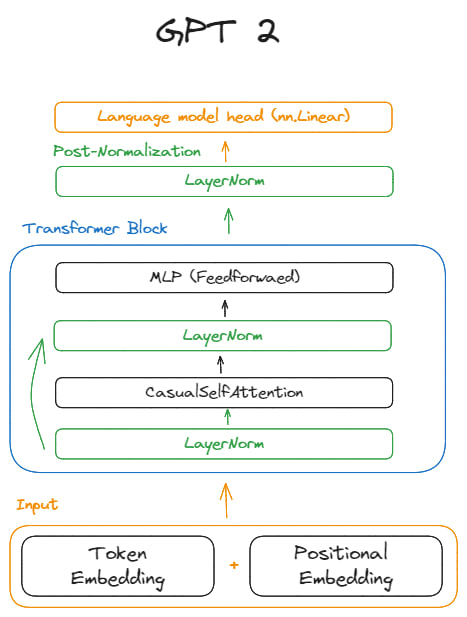

# Large Language Models

## Resources
- [x] [Reproduce GPT-2](https://youtu.be/l8pRSuU81PU?si=4Uc0swNC3g83jMVQ)
- [LLM Course](https://github.com/mlabonne/llm-course)
- [LLM Traning](https://rentry.org/llm-training)

# Project Idea
- Code completion Model
- [Project md](project/llm_project.md)

# Note
## Architecture

1. **Token Embedding and Positional embedding**: 
    - Token embedding: Embedding of the input tokens
    - Positional embedding: Embedding of the position of the input tokens
    - The sum of the two embeddings is the input to the transformer encoder
2. **Transformer block (hidden layers)**:
    - Layer normalization: Normalize the inputs to accelerate the training
    - CasualSelfAttention: Special type of self-attention thar is dessigned to handle sequential data in an autoregressive manner
    - Residual connection: Skip connection to avoid vanishing gradient 
    - Feed forward network: Two linear layers with a GELU activation function
3. **Layer normalization**: Post normalization of the output of the transformer block
4. **Output layer**: Linear layer that gives us the output logits

## Training
- get batch of data: 
    - input: tokenized text
    - target: tokenized text shifted by one token
- forward pass:
    - input: tokenized text
    - output: logits
    - loss: cross entropy loss between the logits and the target
- backward pass:
    - compute the gradients of the loss with respect to the model parameters
- Optimization step:
    - update the model parameters using the gradients

## Optimization tips
- **Learning rate**: Use a cosine learning rate scheduler to stabilize and optimize the traning process
- **Gradient clipping**: Clip the gradients to avoid exploding gradients
- **Use torch.compile**: use the torch compile to optimize the performance of the model
- **Use flash attention**: Use the flash attention to accelerate the training process
- **Use fused implementation of AdamW**: Use the fused implementation of AdamW to accelerate the training process 
- **Use Weight decay**: Use weight decay to regularize the model (Prevent overfitting), It works by adding a penalty to the loss function based on the size of the model's weights. The aim is to discourage the model from developing excessively large weights, which can lead to overfitting.
- **Use gradient accumulation**: Use gradient accumulation to increase the effective batch size without increasing the memory usage
- **Use bfloat16 data type**: Use the bfloat16 data type to accelerate the training process
